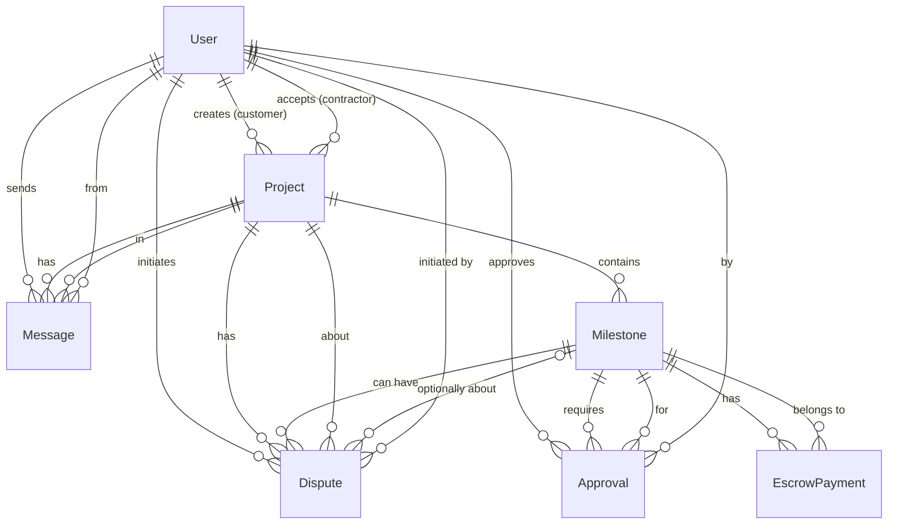

# VertrouwdBouwen - Data Model Overzicht

## Snelle Samenvatting

### Kern Entiteiten
1. **User** (Gebruiker) - Klanten en Aannemers
2. **Project** (Project) - Verbindt klant met aannemer
3. **Milestone** (Mijlpaal) - Project fasen met bedragen
4. **EscrowPayment** (Betaling) - Geld in escrow voor milestone
5. **Approval** (Goedkeuring) - Klant goedkeurt milestone

### Belangrijkste Relaties
- **User** → **Project**: 1 gebruiker heeft N projecten (als klant of aannemer)
- **Project** → **Milestone**: 1 project heeft N milestones
- **Milestone** → **EscrowPayment**: 1 milestone heeft 1 escrow betaling
- **Milestone** → **Approval**: 1 milestone heeft N approvals (goedkeuringen)
- **Approval** → **User**: 1 approval wordt gedaan door 1 gebruiker (klant)

### Workflow
```
Klant maakt Project → Voegt Milestones toe → Aannemer accepteert 
→ Klant stort geld (Escrow) → Aannemer werkt → Dient in 
→ Klant keurt goed → Betaling vrijgegeven
```

---

## Visueel Overzicht (ASCII)

```
┌─────────────┐
│    USER     │
│  (Gebruiker)│
└──────┬──────┘
       │
       ├─────────────────────────────────────────────┐
       │                                             │
       │ (1) als KLANT                               │ (2) als AANNEMER
       │                                             │
       ▼                                             ▼
┌─────────────┐                              ┌─────────────┐
│   PROJECT   │                              │   PROJECT   │
│  (Project)  │                              │  (Project)  │
└──────┬──────┘                              └──────┬──────┘
       │                                             │
       │ (1 project heeft meerdere milestones)      │
       │                                             │
       ▼                                             ▼
┌─────────────┐                              ┌─────────────┐
│  MILESTONE  │                              │  MILESTONE  │
│  (Mijlpaal) │                              │  (Mijlpaal) │
└──────┬──────┘                              └──────┬──────┘
       │                                             │
       │ (1 milestone heeft 1 escrow betaling)        │
       │                                             │
       ▼                                             ▼
┌─────────────┐                              ┌─────────────┐
│ ESCROW      │                              │ ESCROW      │
│ PAYMENT     │                              │ PAYMENT     │
│ (Betaling)  │                              │ (Betaling)  │
└─────────────┘                              └─────────────┘

       │
       │ (1 milestone heeft goedkeuringen)
       │
       ▼
┌─────────────┐
│  APPROVAL   │───┐
│ (Goedkeuring)│  │ (goedgekeurd door USER)
└─────────────┘  │
                 │
                 └──► USER (klant keurt goed)
```

## Entity Relationship Diagram (Mermaid)



## Relatie Overzicht

### 1. User (Gebruiker)
**Rollen**: CUSTOMER, CONTRACTOR, ADMIN

**Relaties**:
- **1:N** met Project (als klant) → `customerProjects`
- **1:N** met Project (als aannemer) → `contractorProjects`
- **1:N** met Approval → `approvals` (goedkeurt milestones)
- **1:N** met Message → `sentMessages` (verstuurt berichten)
- **1:N** met Dispute → `initiatedDisputes` (start geschillen)

**Belangrijke velden**:
- `role`: Bepaalt of gebruiker klant of aannemer is
- `companyName`, `kvkNumber`: Alleen voor aannemers

---

### 2. Project (Project)
**Status**: DRAFT → PENDING_CONTRACTOR → ACTIVE → IN_PROGRESS → COMPLETED

**Relaties**:
- **N:1** met User (klant) → `customer` (verplicht)
- **N:1** met User (aannemer) → `contractor` (optioneel, tot acceptatie)
- **1:N** met Milestone → `milestones` (project fasen)
- **1:N** met Message → `messages` (project communicatie)
- **1:N** met Dispute → `disputes` (mogelijke geschillen)

**Belangrijke velden**:
- `totalBudget`: Totaal project budget
- `status`: Huidige project status
- `contractorId`: Null totdat aannemer project accepteert

---

### 3. Milestone (Mijlpaal)
**Status**: PENDING → IN_PROGRESS → SUBMITTED → APPROVED → PAID

**Relaties**:
- **N:1** met Project → `project` (verplicht, behoort tot één project)
- **1:N** met EscrowPayment → `payments` (escrow betalingen)
- **1:N** met Approval → `approvals` (goedkeuringen)
- **1:N** met Dispute → `disputes` (mogelijke geschillen)

**Belangrijke velden**:
- `amount`: Bedrag voor deze milestone
- `order`: Volgorde binnen project
- `status`: Huidige milestone status

**Workflow**:
1. Klant maakt milestone aan (PENDING)
2. Aannemer start werk (IN_PROGRESS)
3. Aannemer dient in (SUBMITTED)
4. Klant keurt goed/af (APPROVED/REJECTED)
5. Bij goedkeuring: betaling vrijgegeven (PAID)

---

### 4. EscrowPayment (Escrow Betaling)
**Status**: PENDING → HELD → RELEASED / REFUNDED

**Relaties**:
- **N:1** met Milestone → `milestone` (verplicht, één betaling per milestone)

**Belangrijke velden**:
- `amount`: Bedrag in escrow
- `status`: Huidige betalingsstatus
- `heldAt`: Wanneer geld in escrow gezet
- `releasedAt`: Wanneer geld vrijgegeven aan aannemer
- `transactionRef`: Unieke transactie referentie

**Workflow**:
1. Klant stort geld voor milestone (PENDING → HELD)
2. Bij goedkeuring: geld vrijgegeven aan aannemer (RELEASED)
3. Bij afwijzing/annulering: geld terug naar klant (REFUNDED)

---

### 5. Approval (Goedkeuring)
**Status**: PENDING → APPROVED / REJECTED

**Relaties**:
- **N:1** met Milestone → `milestone` (verplicht)
- **N:1** met User → `approver` (verplicht, de klant die goedkeurt)

**Belangrijke velden**:
- `status`: Goedkeuringsstatus
- `comments`: Optionele opmerkingen van klant

**Workflow**:
- Aannemer dient milestone in
- Klant beoordeelt en keurt goed/af
- Bij goedkeuring: milestone status → APPROVED, betaling → RELEASED

---

## Volledige Data Flow

### Project Lifecycle

```
1. KLANT maakt Project aan
   └─> Project.status = DRAFT
   └─> Project.customerId = klant.id
   └─> Project.contractorId = null

2. KLANT voegt Milestones toe
   └─> Milestone.projectId = project.id
   └─> Milestone.status = PENDING
   └─> Milestone.amount = bedrag

3. KLANT publiceert Project
   └─> Project.status = PENDING_CONTRACTOR

4. AANNEMER accepteert Project
   └─> Project.contractorId = aannemer.id
   └─> Project.status = ACTIVE

5. KLANT stort geld voor Milestone
   └─> EscrowPayment.milestoneId = milestone.id
   └─> EscrowPayment.status = HELD
   └─> EscrowPayment.heldAt = now()

6. AANNEMER start werk
   └─> Milestone.status = IN_PROGRESS

7. AANNEMER dient Milestone in
   └─> Milestone.status = SUBMITTED
   └─> Approval.milestoneId = milestone.id
   └─> Approval.approverId = klant.id
   └─> Approval.status = PENDING

8. KLANT keurt goed
   └─> Approval.status = APPROVED
   └─> Milestone.status = APPROVED
   └─> EscrowPayment.status = RELEASED
   └─> EscrowPayment.releasedAt = now()
   └─> Milestone.status = PAID

9. OF KLANT keurt af
   └─> Approval.status = REJECTED
   └─> Milestone.status = REJECTED
   └─> Milestone.status = IN_PROGRESS (terug naar werk)
   └─> EscrowPayment.status = HELD (blijft in escrow)
```

## Belangrijke Relatie Regels

### One-to-Many (1:N)
- **User → Project**: Een gebruiker kan meerdere projecten hebben (als klant of aannemer)
- **Project → Milestone**: Een project heeft meerdere milestones
- **Milestone → EscrowPayment**: Een milestone heeft één escrow betaling
- **Milestone → Approval**: Een milestone kan meerdere approvals hebben (bijvoorbeeld bij herindiening)
- **Project → Message**: Een project heeft meerdere berichten
- **User → Approval**: Een gebruiker kan meerdere milestones goedkeuren

### Many-to-One (N:1)
- **Project → User (customer)**: Meerdere projecten kunnen van één klant zijn
- **Project → User (contractor)**: Meerdere projecten kunnen van één aannemer zijn
- **Milestone → Project**: Meerdere milestones behoren tot één project
- **EscrowPayment → Milestone**: Meerdere betalingen kunnen tot één milestone behoren (in praktijk meestal 1:1)
- **Approval → Milestone**: Meerdere approvals kunnen tot één milestone behoren
- **Approval → User**: Meerdere approvals kunnen van één gebruiker zijn

### Optional Relaties
- **Project.contractorId**: Null totdat aannemer project accepteert
- **Dispute.milestoneId**: Null als geschil over hele project gaat, niet specifieke milestone
- **User.companyName**: Null voor klanten, verplicht voor aannemers

## Query Voorbeelden

### Alle milestones van een project met betalingen
```typescript
const project = await prisma.project.findUnique({
  where: { id: projectId },
  include: {
    milestones: {
      include: {
        payments: true,
        approvals: {
          include: {
            approver: true
          }
        }
      },
      orderBy: { order: 'asc' }
    }
  }
});
```

### Alle projecten van een klant met aannemer info
```typescript
const customerProjects = await prisma.project.findMany({
  where: { customerId: userId },
  include: {
    contractor: true,
    milestones: {
      include: {
        payments: true
      }
    }
  }
});
```

### Milestone met volledige geschiedenis
```typescript
const milestone = await prisma.milestone.findUnique({
  where: { id: milestoneId },
  include: {
    project: {
      include: {
        customer: true,
        contractor: true
      }
    },
    payments: true,
    approvals: {
      include: {
        approver: true
      },
      orderBy: { createdAt: 'desc' }
    },
    disputes: true
  }
});
```

## Status Transitions

### Project Status Flow
```
DRAFT → PENDING_CONTRACTOR → ACTIVE → IN_PROGRESS → COMPLETED
                                    ↓
                                CANCELLED
                                    ↓
                                DISPUTED
```

### Milestone Status Flow
```
PENDING → IN_PROGRESS → SUBMITTED → APPROVED → PAID
                              ↓
                          REJECTED → IN_PROGRESS (herindiening)
```

### Payment Status Flow
```
PENDING → HELD → RELEASED (bij goedkeuring)
              ↓
          REFUNDED (bij annulering/geschil)
```

